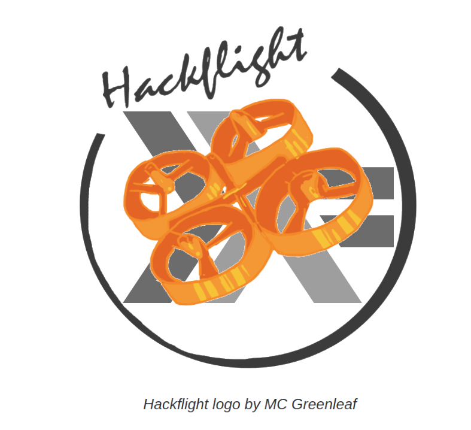

 

<h2>Note: This repository is for development using Haskell.  The
original repository using C++ is now <a href="https://github.com/simondlevy/HackflightCPP">here</a>.
</h2>

## Intro

Hackflight is a Haskell-based software toolkit for building multirotor flight
controllers and simulators.  It is geared toward people like me who want to tinker with
flight-control firmware, and use it to teach students about ideas like inertial
measurement and PID tuning.  <b>If you are in the 99% percent of users who just
want to get your vehicle flying without getting into firmware hacking, I
recommend [Betaflight](http://betaflight.com/)</b> (great for getting started
when you're on a budget) <b>or the [Ardupilot](http://copter.ardupilot.org)
system</b> (for sophisticated mission planning with waypoint navigation and the
like).  In addition to big user communities and loads of great features, these
platforms have safety mechanisms that Hackflight lacks, which will help avoid
injury to you and damage to your vehicle.

## Supported platforms

Hackflight is currently working on the following platforms:

* [Ladybug Flight Controller](https://www.tindie.com/products/TleraCorp/ladybug-flight-controller/) from Tlera Corp

* [HackflightSim](https://github.com/simondlevy/Hackflight/tree/master/sim) flight simulator based on UnrealEngine4

## Standard units

By supporting floating-point operations, these platforms allow us to write
simpler code based on standard units:

* Distances in meters
* Time in seconds
* Quaternions in the interval [-1,+1]
* Euler angles in radians
* Accelerometer values in Gs
* Barometric pressure in Pascals
* Stick demands in the interval [-1,+1]
* Motor demands in [0,1]

## Ground Control Station

Because it is useful to get some visual feedback on things like vehicle orientation and RC receiver
channel values,  we also provide a very simple &ldquo;Ground Control Station&rdquo; (GCS) program
that allows you to connect to the board and see what's going on. Windows users
can run this program directly: just clone the [HackflightGCS](https://github.com/simondlevy/HackflightGCS)
repository and double-click on <b>hackflight.exe</b>.  Others can run the
<b>hackflight.py</b> Python script in the <b>extras/gcs/python</b> folder.  To
run the Python script you'll need to install
[MSPPG](https://github.com/simondlevy/Hackflight/tree/master/extras/parser), a
parser generator for the Multiwii Serial Protocol (MSP) messages used by the
firmware. Follow the directions in that folder to install MSPPG for Python.

## PID Controllers

<b>A PID controller is not the same as a
[flight mode](https://oscarliang.com/rate-acro-horizon-flight-mode-level/).</b>
For example, so-called [Acro mode](http://ardupilot.org/copter/docs/acro-mode.html#acro-mode) 
requires a PID controller based on angular
velocity (a.k.a. rate, computed from the gyrometer) for each of the three angles
(roll, pitch yaw). So-called [Stabilize](http://ardupilot.org/copter/docs/stabilize-mode.html#stabilize-mode) 
mode requires these three angular-velocity controllers,
plus a PID controller based on angle (computed from the quaternion) for the
roll and pitch axes.   To support this arrangement in Hackflight, PID
controllers for aux state 0 will also run in aux states 1 and 2, and PID
controllers for aux state 1 will also run in aux state 2.

  

