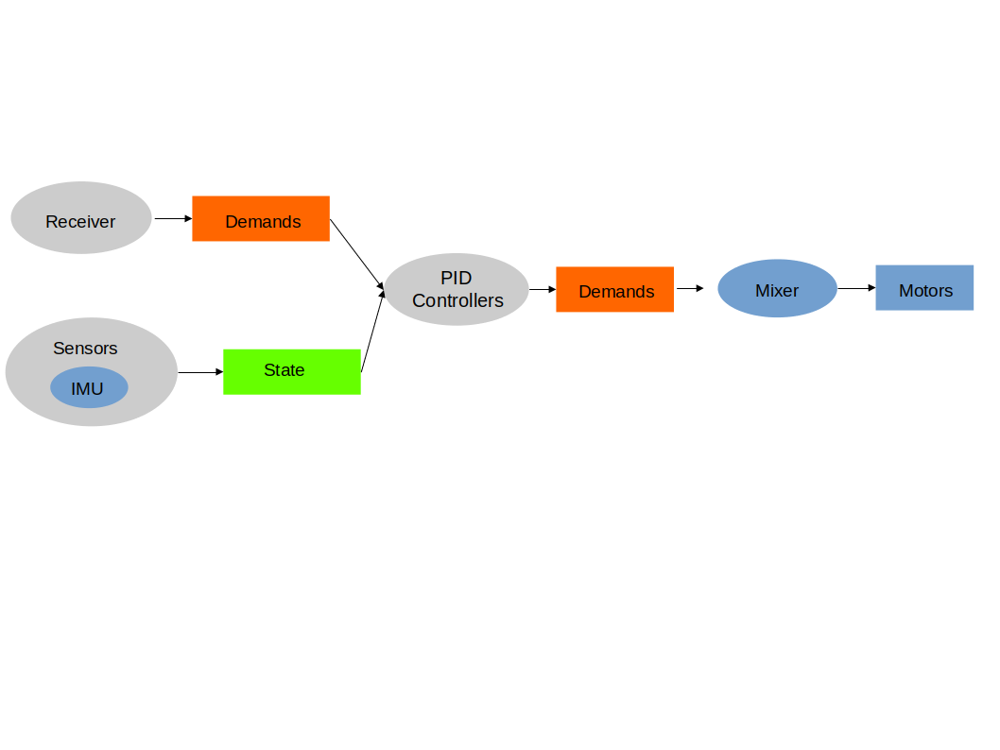

<p align="center"> 

</p>

# Intro

Hackflight is a minimalist software toolkit for building multirotor flight
controllers and simulators.  It is geared toward people like me who want to
tinker with flight-control firmware, and use it to teach students about ideas
like inertial measurement and PID tuning.  <b>If you are in the 99% percent of
users who just want to get your vehicle flying without getting into firmware
hacking, I recommend [Betaflight](http://betaflight.com/)</b> (great for
getting started when you're on a budget, and the origin of much of the code in
Hackflight) <b>or the [Ardupilot](http://copter.ardupilot.org) system</b> (for
sophisticated mission planning with waypoint navigation and the like).  In
addition to big user communities and loads of great features, these platforms
have safety mechanisms that Hackflight lacks, which will help avoid injury to
you and damage to your vehicle.

My original goal with Hackflight was to support a variety of flight-control
boards on any operating system.  Because of the [proliferaton](https://oscarliang.com/flight-controller/)
 of flight-control boards in recent years, and
the [advantages](https://www.reddit.com/r/linux/comments/vytkf/i_dont_get_why_programmers_love_linux_care_to/)
of Linux for rapid software development, I decided to narrow my focus to developing on
Linux using the powerful, inexpensive [Teensy
4.0](https://www.pjrc.com/store/teensy40.html) development board with Arduino
libraries.  Similarly, having tried all the major robotics simulation packages
available, and written my own multiroto
[simulator](https://github.com/simondlevy/MulticopterSim), I have chosen the
powerful, easy-to-use [Webots](https://cyberbotics.com/) platform as the basis
of the Hackflight flight simulator.

# Design principles

Hackflight attempts to maintain a simple relationship between
the code and the elements of the flight-control dataflow diagram shown below.
Boxes represent data, ovals represent functions, and feedback arrows
represent the need for functions that have state (instance variables); for
example, the maintenance of an error integral in a PID controller:

<p align="center"> 

</p>

By using header-only C++ classes whenever possible, avoiding C-style macros and 
[null pointers](https://www.infoq.com/presentations/Null-References-The-Billion-Dollar-Mistake-Tony-Hoare/),
and leveraging existing Arduino libraries for 
[receivers](https://github.com/bolderflight/sbus),
[ESCs](https://github.com/simondlevy/DshotSTM32), and
[IMUs](https://github.com/simondlevy/MPU6x00),
Hackflight supports a [composable](https://www.programmingtalks.org/talk/brian-beckman-dont-fear-the-monad) 
approach to taming the complexity of flight control.

# Simulator

For flight simulation, Hackflight uses [Webots](https://cyberbotics.com/),
a free, open-source robotics simulator. Click [here](webots) to get started.

# Haskell support

If you [love Haskell](https://koerbitz.me/posts/Why-I-love-Haskell.html) as much
as I do and want to see how it can be used for flight control, click [here](haskell).

# Citing Hackflight

Please cite Hackflight as:

```
@ARTICLE{10.3389/fnbot.2020.00016,
AUTHOR={Levy, Simon D.},   
TITLE={Robustness Through Simplicity: A Minimalist Gateway to Neurorobotic Flight},      
JOURNAL={Frontiers in Neurorobotics},      
VOLUME={14},           
YEAR={2020},      
URL={https://www.frontiersin.org/articles/10.3389/fnbot.2020.00016},       
DOI={10.3389/fnbot.2020.00016},      
ISSN={1662-5218}
}
```
