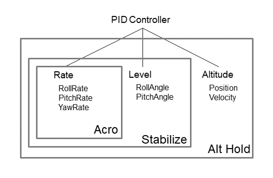

 

## Intro

Hackflight is a software toolkit for building multirotor flight
controllers and simulators.  It is geared toward people like me who want to tinker with
flight-control firmware, and use it to teach students about ideas like inertial
measurement and PID tuning.  <b>If you are in the 99% percent of users who just
want to get your vehicle flying without getting into firmware hacking, I
recommend [Betaflight](http://betaflight.com/)</b> (great for getting started
when you're on a budget, and the origin of much of the code in Hackflight)
<b>or the [Ardupilot](http://copter.ardupilot.org) system</b> (for
sophisticated mission planning with waypoint navigation and the like).  In
addition to big user communities and loads of great features, these platforms
have safety mechanisms that Hackflight lacks, which will help avoid injury to
you and damage to your vehicle.

## Supported platforms

To make it easy to develop flight firmware using Arduino-compatible
microcontrollers, Hackflight is laid out as an Arduino library; however,
this does not limit your ability to use it on other hardware platforms 
and simulators.

Currently, Hackflight has been tested on the following platforms:

* [Ladybug Flight Controller](https://www.tindie.com/products/TleraCorp/ladybug-flight-controller) from Tlera Corp.

* [STM32F405 AIO flight controller](https://betafpv.com/products/f405-20a-aio-2-4s-brushless-flight-controllerblheli_s-v3)

* [MulticopterSim](https://github.com/simondlevy/MulticopterSim) flight simulator based on UnrealEngine

Simulators can use just the <b>.h</b> files in the
[src](https://github.com/simondlevy/Hackflight/tree/master/src) directory, which contain the
basic control algorithms (open-loop control / PID control).  Real flight
controllers use the code in the <b>.c</b> files located in that directory
directory and in the [stm32/src](https://github.com/simondlevy/Hackflight/tree/master/stm32/src) directory,
which contain code for real-time scheduling and for reading from physical sensors and R/C receivers.

## Design principles

Although previously implemented in C++, Hackflight has shifted toward a focus on functional-style
programming in C. For example, instead of having a Receiver class that gets subclassed for different
kinds of receivers (SBUS, DSMX), you pass the appropriate device-access
functions to the the code that retrieve the raw values from the receiver.  

More generally, Hackflight attempts to maintain a simple relationship between
the code and the elements of the flight-control flow diagram shown below:

 

## Ground Control Station

Because it is useful to get some visual feedback on things like vehicle orientation and RC receiver
channel values,  we also provide a very simple &ldquo;Ground Control Station&rdquo; (GCS) program
that allows you to connect to the board and see what's going on. Windows users
can run this program directly: just clone the [HackflightGCS](https://github.com/simondlevy/HackflightGCS)
repository and double-click on <b>hackflight.exe</b>.  Others can run the
<b>hackflight.py</b> Python script in the <b>extras/gcs/python</b> folder.  To
run the Python script you'll need to install
[MSPPG](https://github.com/simondlevy/RoboFirmwareToolkit/tree/main/extras/parser), a
parser generator for the Multiwii Serial Protocol (MSP) messages used by the
firmware. Follow the directions in that folder to install MSPPG for Python.

## PID Controllers

<b>A PID controller is not the same as a
[flight mode](https://oscarliang.com/rate-acro-horizon-flight-mode-level/).</b>
For example, so-called [Acro mode](http://ardupilot.org/copter/docs/acro-mode.html#acro-mode) 
requires a PID controller based on angular
velocity (a.k.a. rate, computed from the gyrometer) for each of the three angles
(roll, pitch yaw). So-called [Stabilize](http://ardupilot.org/copter/docs/stabilize-mode.html#stabilize-mode) 
mode requires these three angular-velocity controllers,
plus a PID controller based on angle (computed from the quaternion) for the
roll and pitch axes.   To support this arrangement in Hackflight, PID
controllers for aux state 0 will also run in aux states 1 and 2, and PID
controllers for aux state 1 will also run in aux state 2.

  

