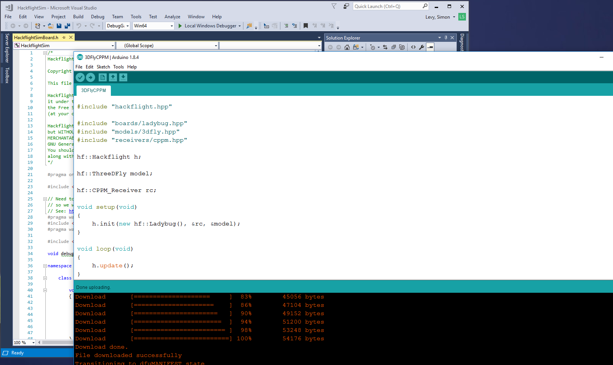

# Hackflight: Simple quadcopter flight control firmware for Arduino / C++ hackers

Hackflight is simple, platform-independent, header-only C++ firmware for quadcopter 
[flight controllers](https://www.tindie.com/products/TleraCorp/ladybug-flight-controller/) 
and [simulators](https://github.com/simondlevy/HackflightSim).  It
is geared toward people like me who want to tinker with flight-control
firmware, and use it to teach students about ideas like inertial measurement
and PID tuning.  <b>If you are in the 99% percent of users who just want to get
your vehicle flying without getting into firmware hacking, I recommend
[Cleanflight](http://cleanflight.com/)</b> (great for getting started when
you're on a budget) <b>or the
[Ardupilot](http://copter.ardupilot.org) system</b> (for
sophisticated mission planning with waypoint navigation and the like).  In
addition to big user communities and loads of great features, these platforms
have safety mechanisms that Hackflight lacks, which will help avoid injury to
you and damage to your vehicle.

Hackflight derives from the Baseflight firmware (which in turn derives from
Multiwii).  Although there is [legacy
support](https://github.com/simondlevy/hackflight/tree/master/extras/legacy) for
STM32F103 flight-controller boards (Naze32 and clones like Flip32, MultiRC,
etc.) the Alienflight F3 board, and a Teensy 3.2-based controller, 
the hardware focus of the project has shifted to the Arduino-compatible,
STM32L4-based [Ladybug FC](https://www.tindie.com/products/TleraCorp/ladybug-flight-controller/).
In addition to offering the full complement of i/o signals (UART, I2C,
SPI, digital, analog), this board has hardware support for floating-point operations, allowing us to
write simpler code based on standard units:

* Euler angles in radians
* Accelerometer values in Gs
* Gyrometer values in radians per second
* Distances in meters, velocities in meters per second
* Axis demands (roll, pitch, yaw) in the interval [-1,+1]
* Throttle demand in [0,1]
* Motor demands in [0,1]

Thanks to some help from [Sytelus](https://github.com/sytelus), the core
Hackflight
[firmware](https://github.com/simondlevy/hackflight/tree/master/src)
adheres to standard practices for C++, notably, short, simple methods and
avoidance of compiler macros like <b>#ifdef</b> that can make it difficult to
follow what the code is doing.  As you can see, the code follows the Arduino
design pattern of a <b>setup()</b> routine that calls the <b>init()</b> method
of a few objects (<b>IMU</b>, <b>Receiver</b>, <b>Board</b>, etc.) and a
<b>loop()</b> routine that calls the <b>update()</b> method and other methods
of those objects.  

Because a quadcopter build typically involves choosing a flight-control board, 
radio receiver, and model (airframe), Hackflight provides a separate C++ class for
each of these components.  The
[Board](https://github.com/simondlevy/Hackflight/blob/master/src/board.hpp)
class specifies a set of abstract (pure virtual) methods that you implement
for a particular flight controller or simulator: getting values from the IMU,
sending commands to the motors, etc.  The
[Receiver](https://github.com/simondlevy/Hackflight/blob/master/src/receiver.hpp)
class performs basic functions associated with R/C control (tracking stick positions,
checking switches) and specifies a set of abstract methods that you implement for
a particular receiver (reading channels values).  The
[Model](https://github.com/simondlevy/Hackflight/blob/master/src/model.hpp)
class is where you specify the PID values for your model.

Because it is useful to get some visual feedback on things like vehicle orientation and RC receiver
channel values,  we also provide a very simple &ldquo;Ground Control Station&rdquo; (GCS) program.
that allows you to connect to the board and see what's going on. Windows users
can run this program directly: just download [this zipfile](http://home.wlu.edu/~levys/hackflight-gcs.zip),
unzip the file, open the folder, and double-click on <b>hackflight.exe</b>.
Others can run the <b>hackflight.py</b> Python script in the
<b>extras/gcs/python</b> folder.  To run the Python script you'll
need to install [MSPPG](https://github.com/simondlevy/hackflight/tree/master/extras/parser), a
parser generator for the Multiwii Serial Protocol (MSP) messages used by the
firmware. Follow the directions in that repository to install MSPPG for Python.

For more information, check out the Hackflight [wiki](https://github.com/simondlevy/Hackflight/wiki).
