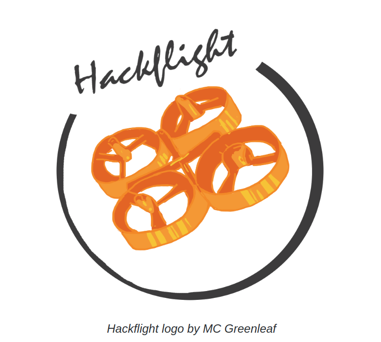
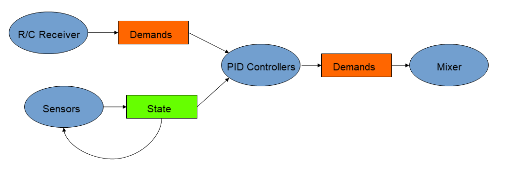
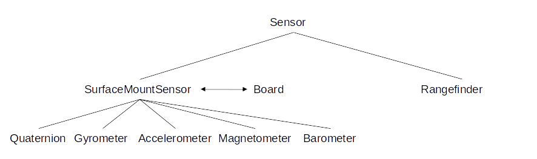
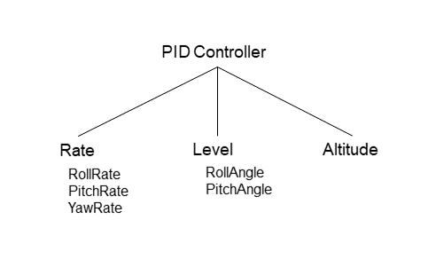

 

 <i>Hackflight logo by MC Greenleaf</i>

Hackflight is simple, platform-independent, header-only C++ firmware for
multirotor flight controllers and simulators.  It is geared toward people like
me who want to tinker with flight-control firmware, and use it to teach
students about ideas like inertial measurement and PID tuning.  <b>If you are
in the 99% percent of users who just want to get your vehicle flying without
getting into firmware hacking, I recommend
[Cleanflight](http://cleanflight.com/)</b> (great for getting started when
you're on a budget) <b>or the [Ardupilot](http://copter.ardupilot.org)
system</b> (for sophisticated mission planning with waypoint navigation and the
like).  In addition to big user communities and loads of great features, these
platforms have safety mechanisms that Hackflight lacks, which will help avoid
injury to you and damage to your vehicle.

Hackflight is current working on the following platforms:

* [Ladybug](https://www.tindie.com/products/TleraCorp/ladybug-flight-controller/) brushed flight controller
from Tlera Corp.

* Certain [STM32F-based](https://github.com/simondlevy/Hackflight/tree/master/extras/stm32f) flight controllers

* [HackflightSim](https://github.com/simondlevy/HackflightSim) flight simulator based on UnrealEngine4

By supporting floating-point operations, these platforms allow us to write simpler code based on standard units:

* Distances in meters
* Time in seconds
* Quaternions in the interval [-1,+1]
* Euler angles in radians
* Accelerometer values in Gs
* Barometric pressure in Pascals
* Stick demands in the interval [-1,+1]
* Motor demands in [0,1]

Thanks to some help from [Sytelus](https://github.com/sytelus), the core
Hackflight
[firmware](https://github.com/simondlevy/hackflight/tree/master/src)
adheres to standard practices for C++, notably, short, simple methods and
minimal use of compiler macros like <b>#ifdef</b> that can make it difficult to
follow what the code is doing.  

Because a multirotor build typically involves choosing a flight-control board,
radio receiver, model (airframe), and PID control settings, Hackflight provides
a separate C++ class to support each of these components:

* The <a href="https://github.com/simondlevy/Hackflight/blob/master/src/board.hpp">Board</a>
class specifies a set of four abstract (pure virtual) methods that you must
implement for a particular flight controller or simulator: getting the current
quaternion from the IMU; getting gyrometer rates from the IMU; sending
commands to the motors; and getting the current time.  
* The <a href="https://github.com/simondlevy/Hackflight/blob/master/src/receiver.hpp">Receiver</a>
class performs basic functions associated with R/C control (tracking stick
positions, checking switches) and specifies a set of abstract methods that you
implement for a particular receiver (reading channels values).  
* The <a href="https://github.com/simondlevy/Hackflight/blob/master/src/mixer.hpp">Mixer</a>
class is an abstract class that can be subclassed for various motor
configurations (QuadX, Hexacopter, Tricopter, etc.).  The <a
href="https://github.com/simondlevy/Hackflight/blob/master/src/mixers/quadx.hpp">QuadX</a>
subclass is already implemented.  
* The <a href="https://github.com/simondlevy/Hackflight/blob/master/src/pidcontroller.hpp">PID_Controller</a>
class provides a constructor where you specify the PID values appropriate for your model (see
<b>PID Controllers</b> discussion below).

Because it is useful to get some visual feedback on things like vehicle orientation and RC receiver
channel values,  we also provide a very simple &ldquo;Ground Control Station&rdquo; (GCS) program.
that allows you to connect to the board and see what's going on. Windows users
can run this program directly: just download [this zipfile](http://home.wlu.edu/~levys/hackflight-gcs.zip),
unzip the file, open the folder, and double-click on <b>hackflight.exe</b>.
Others can run the <b>hackflight.py</b> Python script in the
<b>extras/gcs/python</b> folder.  To run the Python script you'll
need to install [MSPPG](https://github.com/simondlevy/hackflight/tree/master/extras/parser), a
parser generator for the Multiwii Serial Protocol (MSP) messages used by the
firmware. Follow the directions in that folder to install MSPPG for Python.

To support working with new new sensors and PID control algorithms, the <b>Hackflight</b> C++ class provides
two methods: <tt>addSensor</tt> and <tt>addPidController</tt>.   For an example of how to use these
methods, take a look at 
this
[sketch](https://github.com/simondlevy/Hackflight/blob/master/examples/Ladybug/DSMX_VL53L1X/DSMX_VL53L1X.ino),
which uses the [VL53L1X long-range proximity sensor](https://www.tindie.com/products/onehorse/vl53l1-long-range-proximity-sensor/)
to provide altitude hold.

To get started with Hackflight, take a look at the [build wiki](https://github.com/simondlevy/Hackflight/wiki).
To understand the principles behind the software, contniue reading.

## Design Principles

There are two basic data types in Hackflight: 
[state](https://github.com/simondlevy/Hackflight/blob/master/src/datatypes.hpp#L34-L44) and 
[demands](https://github.com/simondlevy/Hackflight/blob/master/src/datatypes.hpp#L25-L32).  For anyone
who's studied [Kalman filtering](http://home.wlu.edu/~levys/kalman_tutorial/), the state will be familiar:
it is the set of values that define the state of the vehicle at a given time
(altitude, orientation, angular velocity, ...), which gets modified by a set of
sensors (gyrometer, accelerometer, barometer, rangefinder, ...).  Once the
state has been determined, it is used by a set of [PID
controllers](https://en.wikipedia.org/wiki/PID_controller) to modify the
demands (throttle, roll, pitch, yaw) received by the R/C receiver or other
control device. Then the demands are then
sent to the [mixer](https://github.com/simondlevy/Hackflight/blob/master/src/mixer.hpp), which determines the
values to be sent to each motor:

### Sensors

As discussed above, Hackflight requires a bare minimum of 
[two sensor readings](https://github.com/simondlevy/Hackflight/blob/master/src/board.hpp#L53-L54),
quaternion and gyrometer.  Technically, the quaternion is more properly part of
the vehicle state, but because of the availability of &ldquo;hardware
quaternion&rdquo; data from modern sensors like the [EM7180 SENtral Sensor
Fusion
Solution](https://www.tindie.com/products/onehorse/ultimate-sensor-fusion-solution-mpu9250/),
we find it convenient to treat the quaternion as a sensor reading.  For
inertial measurement units (IMUs) like the MPU9250 that do not deliver a
hardware quaternion, Hackflight provides a pair of classes &ndash;
[MadgwickQuaternionFilter](https://github.com/simondlevy/Hackflight/blob/master/src/filters.hpp#L94-L95)
and
[MahonyQuaternionFilter](https://github.com/simondlevy/Hackflight/blob/master/src/filters.hpp#L201-L202)
&ndash; that can be used to compute the quaternion on your microcontroller.

To provide access to other popular surface-mount sensors that you may wish to read, Hackflight also has classes to support
[accelerometers](https://github.com/simondlevy/Hackflight/blob/master/src/sensors/accelerometer.hpp), 
[magnetometers](https://github.com/simondlevy/Hackflight/blob/master/src/sensors/magnetometer.hpp), and 
[barometers](https://github.com/simondlevy/Hackflight/blob/master/src/sensors/barometer.hpp).  Together with the
[quaternion](https://github.com/simondlevy/Hackflight/blob/master/src/sensors/quaternion.hpp) and 
[gyrometer](https://github.com/simondlevy/Hackflight/blob/master/src/sensors/gyrometer.hpp), these are all sub-classes 
of the [SurfaceMountSensor](https://github.com/simondlevy/Hackflight/blob/master/src/sensors/surfacemount.hpp)
class, which is in turn a sub-class of the 
[Sensor](https://github.com/simondlevy/Hackflight/blob/master/src/sensor.hpp#L27-L37)
class.  Each surface-mount sensor accesses the appropriate virtual method of the 
[Board](https://github.com/simondlevy/Hackflight/blob/master/src/board.hpp) class 
(<tt>getQuaternion()</tt>, <tt>getGyrometer()</tt>, ...).
The Sensor class is an abstract (virtual) class (a.k.a. interface) specifying two methods that any sensor
must implement: (1) reporting whether the sensor is ready to deliver new data;
(2) modifying the vehicle state.  By requiring each sensor to report its
readiness, we can avoid the need to write a separate timing loop for each
sensor in the main [loop code](https://github.com/simondlevy/Hackflight/blob/master/src/hackflight.hpp#L301-L312). 

If you're mathematically-minded, you can think of a sensor as a function from states to states:
<i>Sensor</i>: <i>State</i> &rarr; <i>State</i>

To implement additional sensors, you can directly sub-class the Sensor class, as we've done with the 
[Rangefinder](https://github.com/simondlevy/Hackflight/blob/master/src/sensors/rangefinder.hpp) 
class that we use to support the
[VL53L1](https://www.tindie.com/products/onehorse/vl53l1-long-range-proximity-sensor/) time-of-flight rangefinder 
in an 
[example sketch](https://github.com/simondlevy/Hackflight/blob/master/examples/Ladybug/DSMX_VL53L1X/DSMX_VL53L1X.ino#L60-L84).  Once 
you've implemented the sub-class(es) for a new sensor, you can call  <tt>Hackflight::addSensor()</tt> to ensure that the sensor
code will be called by the [checkOptionalSensors](https://github.com/simondlevy/Hackflight/blob/master/src/hackflight.hpp#L215-L223) method.

 

### PID Controllers

Like sensors, PID controllers in Hackflight are subclasses of an abstract
[PID Controller](https://github.com/simondlevy/Hackflight/blob/master/src/pidcontroller.hpp#L27-L39) class, 
whose <tt>modifyDemands()</tt> method takes the current state and demands, and modifies the demands based on the
state.  (This class also provides an optional <tt>shouldFlashLed()</tt> method, to help you see when the PID
controller is active.)  The Hackflight class [init](https://github.com/simondlevy/Hackflight/blob/master/src/hackflight.hpp#L287) method
requires you to provide a [Rate](https://github.com/simondlevy/Hackflight/blob/master/src/pidcontrollers/rate.hpp) PID controller; however
(especially for beginners), it is advisable to add a [Level](https://github.com/simondlevy/Hackflight/blob/master/src/pidcontrollers/level.hpp) 
PID controller as well, as shown in this [example](https://github.com/simondlevy/Hackflight/blob/master/examples/Ladybug/DSMX/DSMX.ino#L47-L62).
For an introduction to Rate (a.k.a. Acro) and Level modes, read this [blog post](https://oscarliang.com/rate-acro-horizon-flight-mode-level/).

As with sensors, you can sub-class the <tt>PID_Controller</tt> class and call
[Hackflight::addPidController()](https://github.com/simondlevy/Hackflight/blob/master/src/hackflight.hpp#L293-L299)
to ensure that your PID controller is called in the
[Hackflight::runPidControllers()](https://github.com/simondlevy/Hackflight/blob/master/src/hackflight.hpp#L129-L152) method.
The <tt>addPidController()</tt> method requires you to to specify the auxiliary-switch state in which the specified PID controller will be active.
For example, you can specify that a [Loiter](https://github.com/simondlevy/Hackflight/blob/master/src/pidcontrollers/loiter.hpp)
PID controller will be active in switch state 2, as we've
[done](https://github.com/simondlevy/Hackflight/blob/master/examples/Ladybug/DSMX_VL53L1X/DSMX_VL53L1X.ino#L98-L99) in the previously-cited
example sketch. 

 

If you're mathematically-minded, you can think of a PID Controller as a function from a (<i>State</i>, <i>Demands</i>) pair to <i>Demands</i>:
 <i>PID Controller</i>: <i>State</i> &times; <i>Demands</i> &rarr; <i>Demands</i>

### Control Flow Diagrams

 <i>Courtesy of Juan Gallostra</i>

#### Rate PID

 

#### Level PID

 

