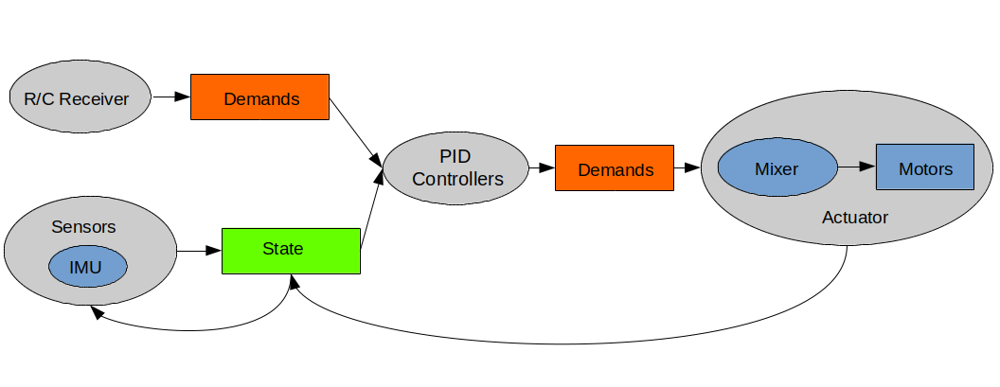

<p align="center"> 

</p>

## Intro

Hackflight is a C++ software toolkit for building multirotor flight
controllers.  It is geared toward people like me who want to tinker with
flight-control firmware, and use it to teach students about ideas like inertial
measurement and PID tuning.  <b>If you are in the 99% percent of users who just
want to get your vehicle flying without getting into firmware hacking, I
recommend [Betaflight](http://betaflight.com/)</b> (great for getting started
when you're on a budget, and the origin of much of the code in Hackflight)
<b>or the [Ardupilot](http://copter.ardupilot.org) system</b> (for
sophisticated mission planning with waypoint navigation and the like).  In
addition to big user communities and loads of great features, these platforms
have safety mechanisms that Hackflight lacks, which will help avoid injury to
you and damage to your vehicle.


## Use cases

Hackflight has been tested on the following platforms:

* [Ladybug Brushed Flight Controller](https://www.tindie.com/products/TleraCorp/ladybug-flight-controller) from Tlera Corp.

* [BetaFVP 75mm Brushless Whoop Quadcopter](https://betafpv.com/products/beta75x-2s-whoop-quadcopter) with
[FrSky XSR SBUS receiver](https://www.frsky-rc.com/product/xsr/).


* [Diatone Cube 229 Brushless Quadcopter](https://www.diatoneusa.com/store/p659/Diatone_Toothpick_Cube_229_8500_PNF.html) with
[Spektrum DSMX micro receiver](https://betafpv.com/products/fullspeed-dsmx-receiver).

* [Darwin FPV BabyApe Quadcopter](https://www.getfpv.com/darwinfpv-baby-ape-pro-v2-3-quadcopter-w-caddx-ant.html)

* [MulticopterSim](https://github.com/simondlevy/MulticopterSim) flight simulator based on UnrealEngine

To make it easy to develop flight firmware using Arduino-compatible
microcontrollers, Hackflight is laid out as an Arduino library and uses
the Arduino API; however, the core flight-control algorithm is hardware-independent.

## Design principles

Hackflight attempts to maintain a simple relationship between
the code and the elements of the flight-control dataflow diagram shown below.
Boxes represent data, ovals represent functions, and feedback arrows
represent the need for functions that have state (instance variables); for
example, the maintenance of an error integral in a PID controller:

<p align="center"> 

</p>

By using header-only C++ classes whenever possible, avoiding C-style macros and 
[null pointers](https://www.infoq.com/presentations/Null-References-The-Billion-Dollar-Mistake-Tony-Hoare/),
and leveraging existing Arduino libraries for 
[receivers](https://github.com/bolderflight/sbus),
[ESCs](https://github.com/simondlevy/DshotSTM32), and
[IMUs](https://github.com/simondlevy/MPU6x00),
Hackflight supports a [composable](https://www.programmingtalks.org/talk/brian-beckman-dont-fear-the-monad) 
approach to taming the complexity of flight control: you instantiate a Board
subclass, passing it your IMU settings, PID controllers, mixer, ESC type, and LED
pin number.  In your ```loop``` function, you just call the ```step()``` method
on the Board object, passing it the raw values from your IMU.  Look at this
[example
program](https://github.com/simondlevy/Hackflight/blob/master/examples/MambaF411Dsmx/MambaF411Dsmx.ino)
to get an idea of how this approach works.

## Desktop visualizer app

Because it is useful to get some visual feedback on things like vehicle orientation and RC receiver
channel values,  we also provide <b>HFViz</b>, a very simple visualizer program
that allows you to connect to the board and see what's going on. Check out the HFViz
[README](https://github.com/simondlevy/Hackflight/blob/master/hfviz/README.md) for more information.

## Citing Hackflight

Please cite Hackflight as:

```
@ARTICLE{10.3389/fnbot.2020.00016,
AUTHOR={Levy, Simon D.},   
TITLE={Robustness Through Simplicity: A Minimalist Gateway to Neurorobotic Flight},      
JOURNAL={Frontiers in Neurorobotics},      
VOLUME={14},           
YEAR={2020},      
URL={https://www.frontiersin.org/articles/10.3389/fnbot.2020.00016},       
DOI={10.3389/fnbot.2020.00016},      
ISSN={1662-5218}
}
```
