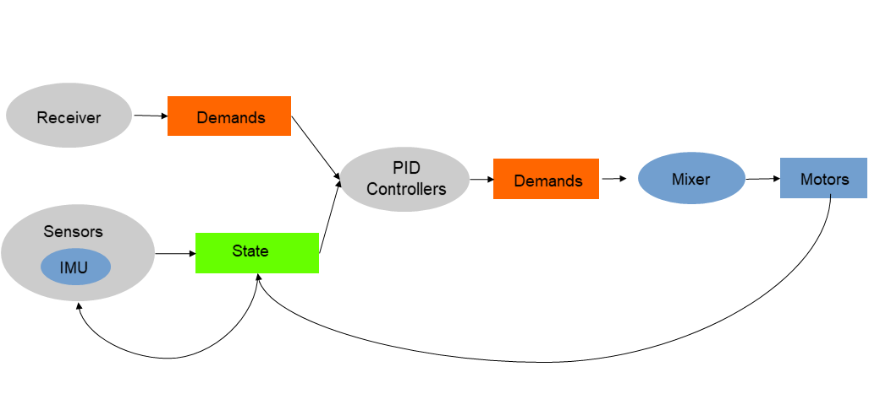

 

## Intro

Hackflight is a C++ software toolkit for building multirotor flight
controllers and simulators.  It is geared toward people like me who want to tinker with
flight-control firmware, and use it to teach students about ideas like inertial
measurement and PID tuning.  <b>If you are in the 99% percent of users who just
want to get your vehicle flying without getting into firmware hacking, I
recommend [Betaflight](http://betaflight.com/)</b> (great for getting started
when you're on a budget, and the origin of much of the code in Hackflight)
<b>or the [Ardupilot](http://copter.ardupilot.org) system</b> (for
sophisticated mission planning with waypoint navigation and the like).  In
addition to big user communities and loads of great features, these platforms
have safety mechanisms that Hackflight lacks, which will help avoid injury to
you and damage to your vehicle.

## Supported platforms

To make it easy to develop flight firmware using Arduino-compatible
microcontrollers, Hackflight is laid out as an Arduino library; however,
this does not limit your ability to use it on other hardware platforms 
and simulators.

Currently, Hackflight has been tested on the following platforms:

* [Ladybug Flight Controller](https://www.tindie.com/products/TleraCorp/ladybug-flight-controller) from Tlera Corp.

* [STM32F405 AIO flight controller](https://betafpv.com/products/f405-20a-aio-2-4s-brushless-flight-controllerblheli_s-v3)
from BetaFPV

* [MultiSim](https://github.com/simondlevy/MultiSim) flight simulator based on UnrealEngine

## Design principles

Hackflight attempts to maintain a simple relationship between
the code and the elements of the flight-control flow diagram shown below.
Boxes represent data, ovals represent functions, and feedback arrows
represent the need for functions that have state (instance variables); for
example, the maintenance of an error integral in a PID controller:

 

By using header-only C++ classes whenever possible, and avoiding C-style macros and
 [complicated inheritance](https://queue.acm.org/detail.cfm?id=2038036), 
Hackflight supports a [composable](https://www.programmingtalks.org/talk/brian-beckman-dont-fear-the-monad) 
approach to taming the complexity of flight control.  Check out this
[example program](https://github.com/simondlevy/Hackflight/blob/master/examples/betfpv-f405-sbus/main.cpp#L37-L71)
to get an idea of how this approach works.

## Ground Control Station

Because it is useful to get some visual feedback on things like vehicle orientation and RC receiver
channel values,  we also provide a very simple &ldquo;Ground Control Station&rdquo; (GCS) program
that allows you to connect to the board and see what's going on. Windows users
can run this program directly: just clone the [HackflightGCS](https://github.com/simondlevy/HackflightGCS)
repository and double-click on <b>hackflight.exe</b>.  Others can run the
<b>gcs.py</b> Python script in the <b>gcs</b> folder.
