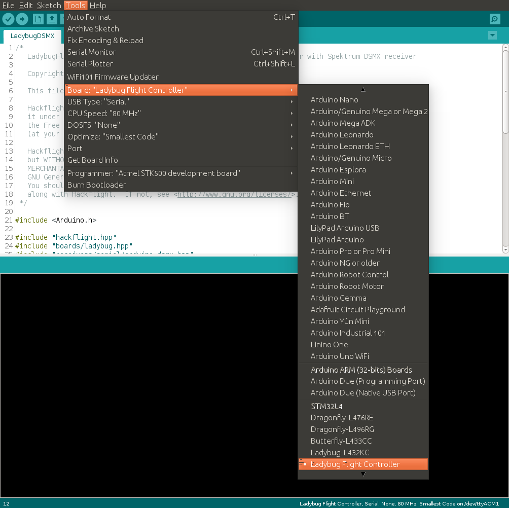
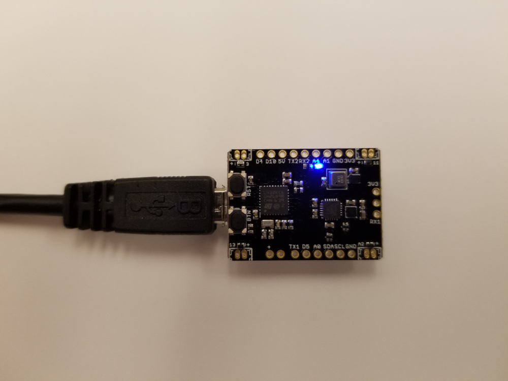

## Ladybug Flight Controller: Arduino setup



<p>

If you haven't already installed the latest version of the [Arduino
IDE](https://www.arduino.cc/en/Main/Software), you should do that now.  If you're running Windows, you should choose to top-listed item, <b>Windows installer</b> (instead of the Windows app store).  Linux users can follow [these instructions](https://www.arduino.cc/en/Guide/Linux), and Mac OS X users can follow [these](https://www.arduino.cc/en/Guide/MacOSX). Whichever OS you're running, please consider donating to the Arduino Project as part of the download!

To get 32-bit Arduino support, go to <b>Tools/Board/Boards Manager ...</b> (top
of the <b>Boards</b> menu), and select the box for <b>Arduino SAM Boards
(32-bits ARM Cortex M3)</b>, and click the Install button.  Although the
STM32L4 line are an ARM Cortex M4 boards, this step will install the gnu-arm compiler
that will work with these and other ARM Cortex boards.

If you haven't already cloned the Hackflight
[repository](https://github.com/simondlevy/LadybugFC) into your
<b>Arduino/libraries</b> folder, do that now.  
(Typically, your <b>Arduino</b>
folder is in your <b>Documents</b> folder on Windows and OS X, and in your home
folder on Linux.  Keeping your hardware support and libraries in this folder,
instead of in the Arduino IDE installation folder, will ensure that they
persist after you download subsequent versions of the Arduino IDE.) Next, clone
[this repository](https://github.com/simondlevy/grumpyoldpizza) into your
<b>Arduino/hardware</b> folder. Launch the Arduino IDE and under
<b>Tools/Boards</b> you should see several new boards toward the bottom of the
menu, including <b>Ladybug Flight Controller</b>.

Finally, you're going to add some OS-specific support allowing your computer to talk to the STM32L4 boards:

##### Linux

 1. Go to Arduino/hardware/grumpyoldpizza/stm32l4/drivers/linux/
 2. sudo cp *.rules /etc/udev/rules.d
 3. reboot

#####  Windows

 1. Download [Zadig](http://zadig.akeo.ie)
 2. Plugin STM32L4 board and toggle the RESET button while holding down the BOOT button
 3. Let Windows finish searching for drivers
 4. Start ```Zadig```
 5. Select ```Options -> List All Devices```
 6. Select ```STM32 BOOTLOADER``` from the device dropdown
 7. Select ```WinUSB (v6.1.7600.16385)``` as new driver
 8. Click ```Replace Driver```
 9. Window 7s only:
     1. Go to Arduino/hardware/grumpypoldpizza/stm32l4/drivers/windows
     2. Right-click on ```dpinst_x86.exe``` (32 bit Windows) or ```dpinst_amd64.exe``` (64 bit Windows) and select ```Run as administrator```
     3. Click on ```Install this driver software anyway``` at the ```Windows Security``` popup as the driver is unsigned


## Blinky



<p>

Of course, no Arduino setup can be complete until you test your board with the beloved
Blink sketch! Having launched the Arduino IDE, under <b>Tools/Board</b> choose 
<b>Ladybug Flight Controller</b> and under <b>Tools/Port</b> select the serial port on which your
board is connected.  

Under <b>File/Examples/01. Basics</b> choose <b>Blink</b>.  
Save a copy of this sketch in a temporary location (like your Desktop), and change all instances of ```LED_BUILTIN``` to
```A4```.

Flash the Blink sketch, and the LED on the board should start blinking on and
off.  If you can't flash the sketch (countdown <i>10 9 .. 1 FAIL</i>), disconnect the board,
reconnect it while holding down the Boot button (labeled <b>BTN</b>), and try again.

<hr>

<b>Next</b>: 
<br>[EM7810 SENtral Sensor Hub](https://github.com/simondlevy/Hackflight/wiki/01-EM7180-SENtral-Sensor-Hub)

