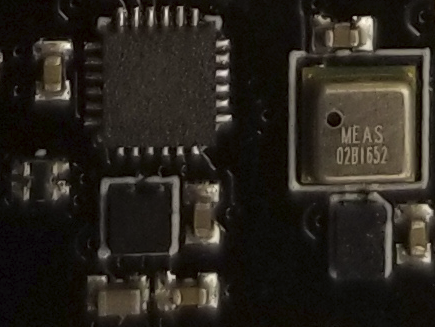

The EM7180 SENtral Sensor Hub onboard your LadybugFC has already been flashed
with its own firmware for fusing the the accelerometer, gyrometer, and
magnetometer into a set of
[quaternion](http://www.chrobotics.com/library/understanding-quaternions)
readings from which the vehicle's orientation (roll, pitch, yaw) will be
computed. To get the EM7180 to talk to your LadybugFC (or other Arduino-compatible
board), we've provided a [library](https://github.com/simondlevy/USFS) that
you should clone into your Arduino libraries folder.
As usual with Arduino, you'll need to close and re-open the Arduino IDE to
access the new libraries.  Under <b>File/Examples</b>, you should see a new
menu <b>EM1780</b>. 

In the Arduino IDE, use <b>Tools/Board</b> to select <b>Ladybug Flight Controller</b>,
and <b>Tools/Port</b> to choose the serial port on which you've connected the
LadybugFC. Then flash the sketch in <b>File/Examples/EM7180/GetInfo</b> onto
your LadybugFC.  In the Serial Monitor (<b>Tools/Serial Monitor</b>) you should
see a report showing you status of the EM7180. The report will repeat every
second, so you can view it at any time after flashing the GetInfo sketch.

## EM7180 SENtral Sensor Hub calibration *

Now would be a good time to calibrate the EM7180 onboard your LadybugFC, as
described in this
[tutorial](https://github.com/kriswiner/EM7180_SENtral_sensor_hub/wiki/F.--Magnetometer-and-Accelerometer-Calibration).
Although the LadybugFC will fly your vehicle pretty well without calibration,
you'll want to calibrate it to get the full
[advantage](https://github.com/kriswiner/EM7180_SENtral_sensor_hub/wiki/H.-Typical-Results-Using-the-SENtral)
of accuracy provided by the EM7180.  Using the Arduino IDE, flash the sketch in
<b>File/Examples/EM7180/WarmStartAccCal</b> onto your LadybugFC.  Follow the
directions in the tutorial to complete the calibration.

<b>Next</b>: [Choosing a Receiver](https://github.com/simondlevy/Hackflight/wiki/02-Choosing-a-receiver)
