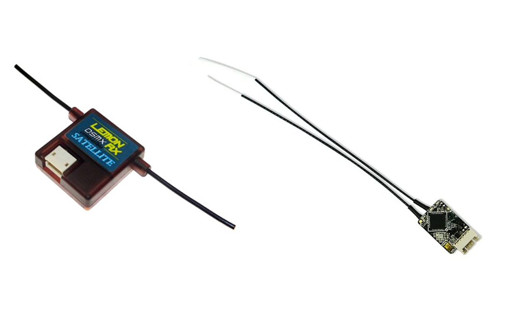

Hackflight allows you to use different kinds of R/C
receivers (and potentially other kinds of wireless controllers).  Currently, we
are supporting the protocols used in the two most popular micro-copter receivers: 
Futaba/FrSky SBUS protocol and Spektrum DSMX.

1. DSMX serial receiver protocol used in the [Lemon RX DSMX Satellite
Receiver](https://www.amazon.com/gp/product/B00SUM3H6O/ref=oh_aui_search_detailpage?ie=UTF8&psc=1)

2. SBUS serial receiver protocol used in the 
[FrSky R-XSR Micro Receiver](https://www.amazon.com/dp/B074QHJRBC?psc=1&ref=ppx_yo2ov_dt_b_product_details):

Later in this wiki we will show you how to wire up one of these receivers to your LadybugFC.  
The point of cloning the repository now is to enable you to flash the Hackflight firmware in the next step.

<b>Next</b>: [Setting PID parameters](https://github.com/simondlevy/Hackflight/wiki/03-Setting-PID-parameters)
