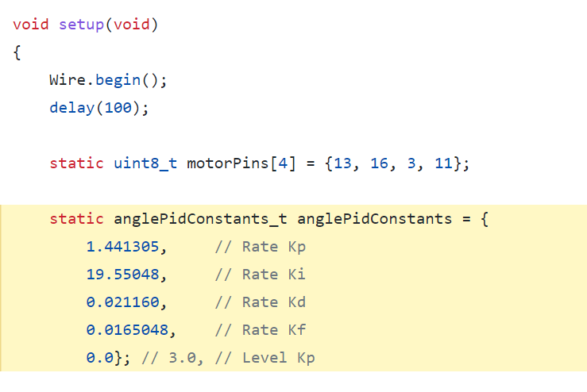

As this
[sketch](https://github.com/simondlevy/Hackflight/blob/master/examples/LadybugDsmx/LadybugDsmx.ino#L38-L43)
shows, it's simple to set the Rate PID and Level PID parameters for your a
model (airframe) like the [3D Fly](https://www.thingiverse.com/thing:2519301).
We've found [this video](https://www.youtube.com/watch?v=30Au6sEv6-o) helpful
for understanding the basics of PID tuning.

<b>Next</b>: [Flashing the firmware](https://github.com/simondlevy/Hackflight/wiki/04-Flashing-the-firmware)
