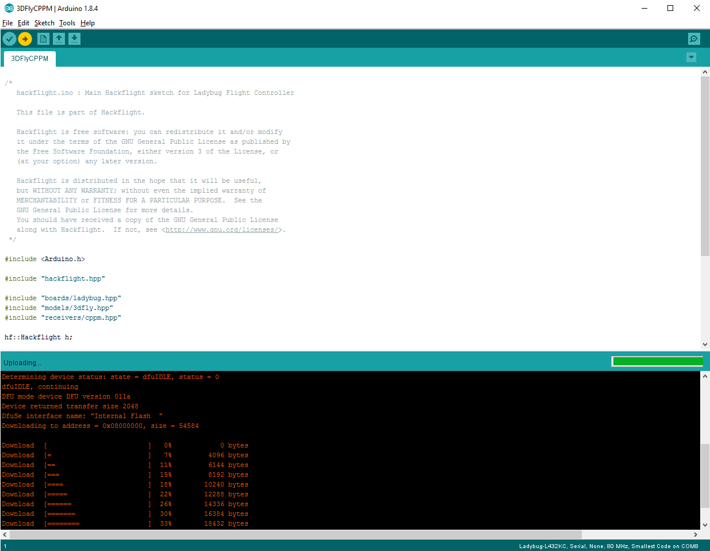

In the Arduino IDE, <b>File/Examples/Hackflight/Ladybug</b> contains example sketches
ready to flash onto your LadybugFC. For example, 
[LadybugSBUS](https://github.com/simondlevy/LadybugFC/blob/master/examples/LadybugSBUS/LadybugSBUS.ino)
is appropriate if you're using an SBUS receiver (like the FrSky XM) and an airframe like the 3DFly.
If everything's working, flashing one of these sketches onto your LadybugFC
will cause the blue LED on the board to flash rapidly for a moment,
indicating its startup sequence. 

<b>Next</b>: [Motor connectors](https://github.com/simondlevy/Hackflight/wiki/05-Motor-connectors)

