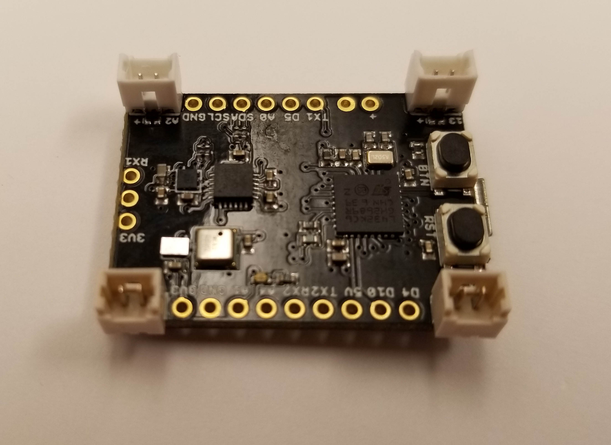
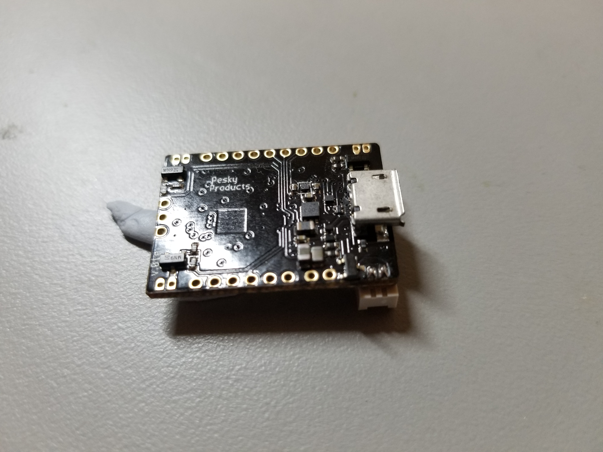
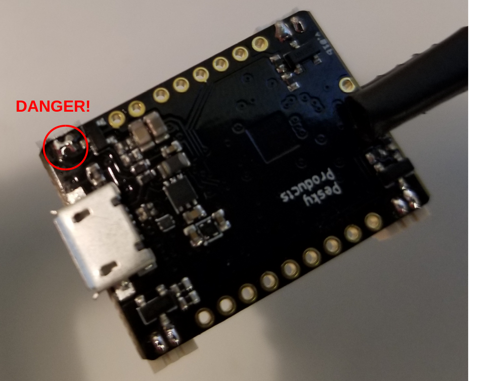

Now it's time to solder on the connectors you'll need to power the board, run the motors,
and get the signal from the R/C receiver.  For a tiny board like this, we suggest using
[.015" solder](https://www.amazon.com/gp/product/B005T8NL22/ref=oh_aui_search_detailpage?ie=UTF8&psc=1)
and a [pencil-tip](https://www.amazon.com/gp/product/B0002BSP4K/ref=oh_aui_search_detailpage?ie=UTF8&psc=1)
on your iron, to avoid the blobbing you can get with  thicker solder or a screwdriver tip.

If you prefer to solder your motor wires directly to the flight controller, you can skip this step; 
however, we've found that using tiny "Picoblade"
[Molex connectors](https://www.digikey.com/product-detail/en/molex-llc/0530470210/WM1731-ND/242853)
makes it easier to swap out motors.  (As discussed 
[here](https://www.rcgroups.com/forums/showthread.php?1493712-JST-connector-confusion-the-real-story), 
you'll also see these connectors referred to erroneously as JST.) If you're
going to use these connectors, you'll want to attach them now, because it will
be more difficult to solder them to the board once you've attached the battery
connector and the receiver.

Here's a photo of the board with all four motor connectors attached.  (The
different coloring of the connectors on opposite sides is meaningless; those
are just the connectors that I pulled out of the bag.)  Note that for the
proper polarity, <b>the holes on the connectors face in</b>:

Getting the connectors to stick to the board while you're soldering them is a cinch if
you use a little piece of [Blue-Tack](https://www.amazon.com/Blu-Tack-S050Q-Reusable-Adhesive-75g/dp/B001FGLX72)
to hold the board down:

The image above shows one of the four connectors soldered onto the LadybugFC.  Note the clean separation
between the two solder joints on the connector.  Even if you're careful, it's possible accidentally to solder
a "bridge" between the two connector pins, causing a dangerous short-circuit:

If this happens, you can usually remove the bridge by gently swiping the soldering tip between the bridged
connectors.  For a really big, blobby bridge you may be better off using a 
[solder sucker](https://www.amazon.com/gp/product/B003FHYL7I/ref=oh_aui_search_detailpage?ie=UTF8&psc=1) to remove all the solder and trying again.

<b>Next</b>: [Receiver connection](https://github.com/simondlevy/Hackflight/wiki/06-Receiver-connection)
