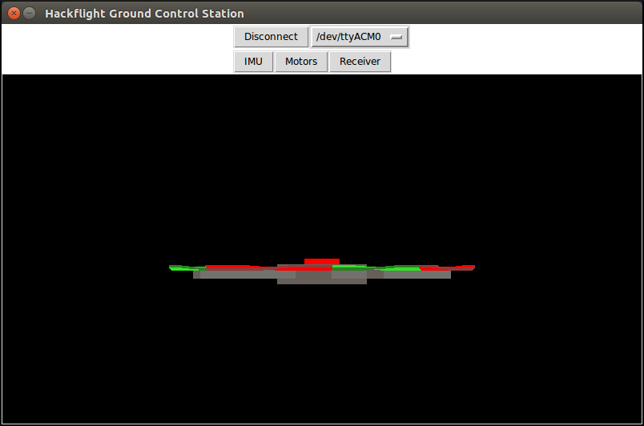
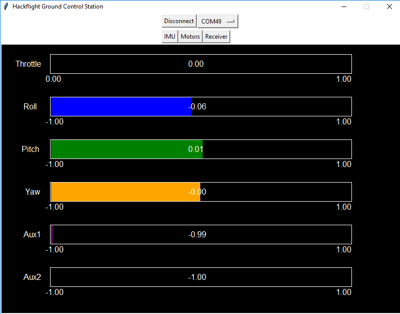

Now that you've got your receiver set up, it would be nice to test the signals
coming into it from your transmitter.  Although Hackflight was designed to be
programmable entirely with Arduino, it is useful to get some visual feedback on
signals like this, as well as IMU orientation.  Consistent with our minimalist
approach, we've provided a simple "Ground Control Station" (GCS) to support
this kind of testing.  

To run the GCS on Windows, clone the
[HackflightGCS](https://github.com/simondlevy/HackflightGCS) repository, and
double-click on <b>hackflight.exe</b>.  Windows will probably ask you if it's okay to run the
program (<b>Windows protected your PC / More info / Run anyway</b>).  Choose
the port on which you're connected to your LadybugFC, click <b>Connect</b>, and
you should be able to manipulate the board and see the orientation of your
hypothetical quadcopter.  Once that's working, you'll probably want to put a
shortcut to hackflight.exe on your Desktop.

For other operating systems (or to develop GCS yourself), you'll need to install:

* Python

* pySerial

* MSPPG, a parser generator for the Multiwii
Serial Protocol (MSP) messages used by the Hackflight firmware.  After cloning
the Hackflight repository, follow this
[README](https://github.com/simondlevy/LadybugFC/tree/master/extras/parser) to
install MSPPG on your computer.  

Then use your favorite Python IDE (we prefer IDLE, which comes bundled with
Python) to open and run the <b>hackflight.py</b> script in <b>Hackflight/extras/gcs/python</b>.  

Whichever way you launch the GCS, you can use the com-ports menu next the the <b>Connect</b>
button to choose your com port (e.g., <b>COM11</b> for Windows, <b>/dev/ttyACM0</b> for Linux).
Having chosen your com port, click on the <b>Connect</b> button, and you should
see a quadcopter image like the one above.  Manipulating the board should move
the image in the corresponding way.

Now, having turned your transmitter on, click the <b>Receiver</b> button in the
GCS.  You should see something like this:

 

Moving the sticks and auxiliary switch on your transmitter should cause the
corresponding channel-bars to move in the GCS.  If the wrong bars are moving in
the GCS, or you're not getting the full range of motion,
you'll need to configure the mixer and/or servo setup on your transmitter.  For Spektrum transmitters
we found [this video](https://www.youtube.com/watch?v=UAgq0ts0NWg) helpful.  For Taranis, we're using the latest Open-TX [firmware](http://downloads.open-tx.org/2.2/sdcard/), which defaults to the TAER (Throttle-Aileron-Elevator-Rudder) channel setup.  By clicking the <b>Menu</b> and then clicking the <b>Page</b> button five times, we can add a switch to the mix (we use SC, because it's convenient for right-handed access), yielding the following mix:

* CH1 100 Thr
* CH2 100 Ael
* CH3 100 Ele
* CH4 100 Rud
* CH5 100 SC

<b>Next</b>: [Power connection](https://github.com/simondlevy/Hackflight/wiki/08-Power-connection)
