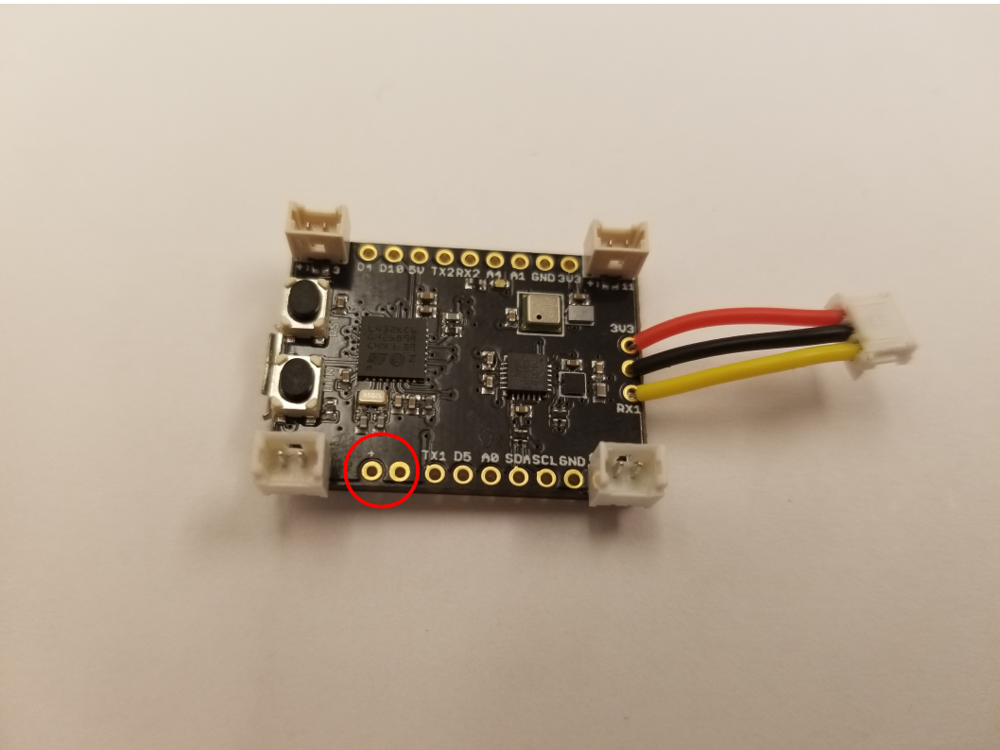
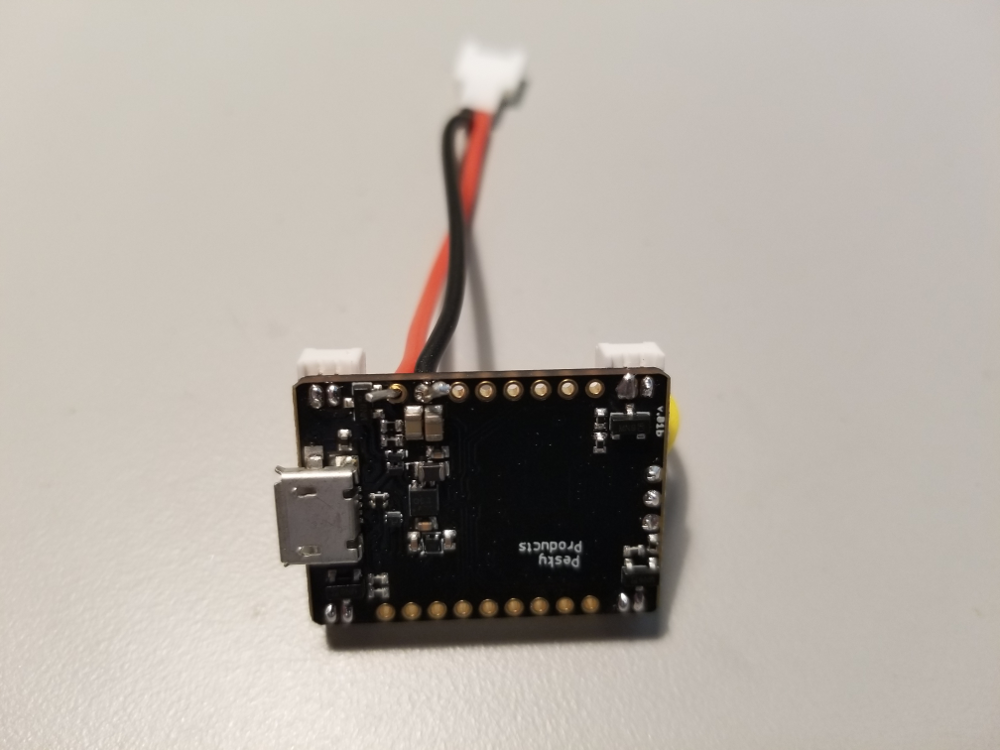

The LadybugFC is designed to be powered by a standard single-cell (1S) 3.7-volt lipo battery. Although there
are many such batteries available, we have had good experiences with 
[these](https://hobbyking.com/en_us/turnigy-nano-tech-750mah-1s-35-70c-lipo-pack-walkera-v120d02s-qr-infra-x-qr-w100s.html) 750mAh batteries that use Walkera-style 
[connectors](https://www.amazon.com/gp/product/B00VRZ0GBK/ref=oh_aui_detailpage_o00_s00?ie=UTF8&psc=1). The
female connectors are the ones you'll solder to your LadybugFC, so we recommend putting them in their own bag, 
and stashing the male connectors in a place where you won't accidentally use them by mistake.  

Here's where we'll solder the female connectors to the board:

The connector wires are already tinned, but are a bit too short to go clear through the holes. 
So all you need to do is pinch off another couple millimeters of insulation,
and feed the wires through the board top-to-bottom.  The wires may seem too
thick to go through the holes, but we've found that with a little patience, you
can usually feed the wires through by twisting them a little.  The image below
shows the board and connector, with one of the wires soldered:

As with the receiver wires, you should clip off the protruding segment on the bottom after soldering.

<b>Next</b>: [Motor testing](https://github.com/simondlevy/Hackflight/wiki/09-Motor-testing)
