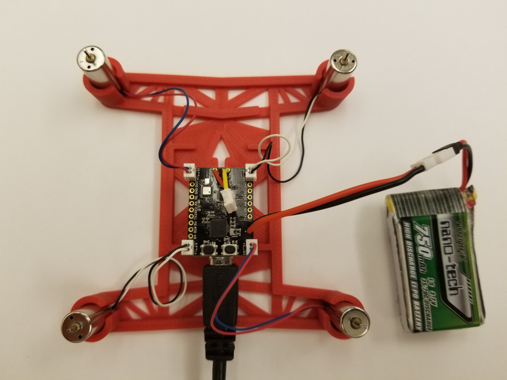
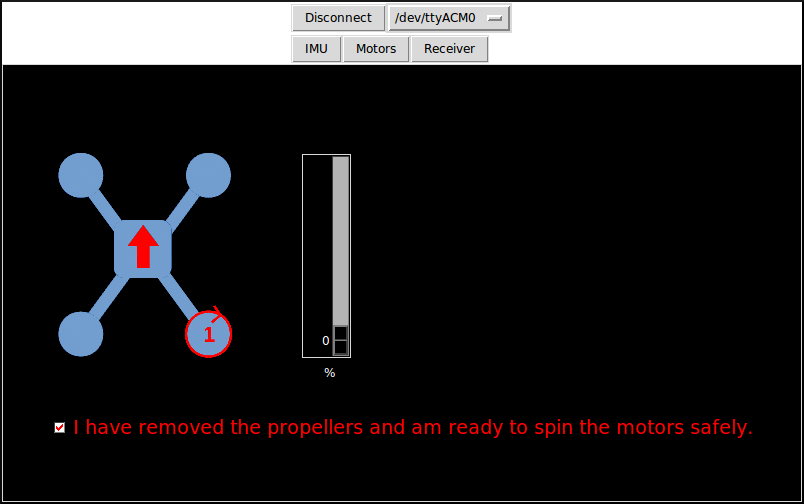

Now that your LadybugFC is all wired up, it's time to test it with some brushed DC motors.  

The cardinal rule of motor testing is: <b>REMOVE PROPELLERS BEFORE TESTING</b>.  Although the little DC motors
and props you use with LadybugFC are unlikely to cause the kind of serious injury you can suffer by 
ignoring this rule on a larger vehicle, testing with props on can still [hurt you](images/ouchie.png)
and snag delicate wires.  So if you're trying out your LadybugFC on an already-assembled
vehicle, <i>remove the #$%@ propellers now!</i>

Although you can use the LadybugFC with any brushed-motor quadcopter, we're going to use a 
[modified version](https://www.thingiverse.com/thing:2519301)
of the classic 3D Fly frame from Hovership, Inc.  We added a little block in the center to allow you to mount the
LadybugFC (or other micro FC) easily, with double-sided 
[VHB tape](https://www.amazon.com/gp/product/B00XIMFZVQ/ref=oh_aui_search_detailpage?ie=UTF8&psc=1),
providing enough clearance to plug in your USB cable.  This frame is made for the popular 8.5x20mm 
[motors](https://www.amazon.com/gp/product/B01JQQ3U5K/ref=oh_aui_search_detailpage?ie=UTF8&psc=1) 
used in the Hubsan X4 and similar entry-level vehicles.  Like the higher-performance brushed DC
[motors](https://micro-motor-warehouse.com/collections/all-motors) available today,
these motors have a connector that will plug into the Molex connectors that we soldered onto the
LadybugFC [earlier](https://github.com/simondlevy/Hackflight/wiki/D:-Motor-connectors).

Here is the frame with the LadybugFC and motors attached, ready for testing:

Note the orientation of the board (USB at rear) and 
that motors 1 (right rear) and 4 (front left) are clockwise-spinning, with
red/blue wires, and motors 2 (right front) and 3 (left rear)
counter-clockwise, with black/white wires. For greater clarity, we've also
removed the receiver from its cable.

Once you've got your vehicle set up like this with the Ladybug powered by the
battery and talking to your computer over USB, you can use
Hackflight GCS to test the motors.  After clicking <b>Connect</b>, click the <b>Motors</b> 
button.  Click the little checkbox to confirm that you've (wait for it ...) <b>REMOVED
THE PROPELLERS</b>, and you'll see an image like this:

Now you can click on the location of each motor and use the slider to run the motor from 0% through
100% of its speed range (though there's probably no reason to go above 50%).  By placing your thumb
on the motor shaft as it is spinning, you can ensure that the motor is spinning in the correct direction
described above.

As before, if you prefer not to use the Ground Control Station, we've provided a 
sketch (<b>File/Examples/Hackflight/motortest</b>) that you can use to test the
motors.  By un-commenting each <b>MOTOR_PIN</b> declaration at the
[top](https://github.com/simondlevy/LadybugFC/blob/master/examples/motortest/motortest.ino#L24-L27)
of the sketch, you can spin each motor separately. 

<b>Next</b>: [Maiden flight](https://github.com/simondlevy/Hackflight/wiki/10-Maiden-flight)
