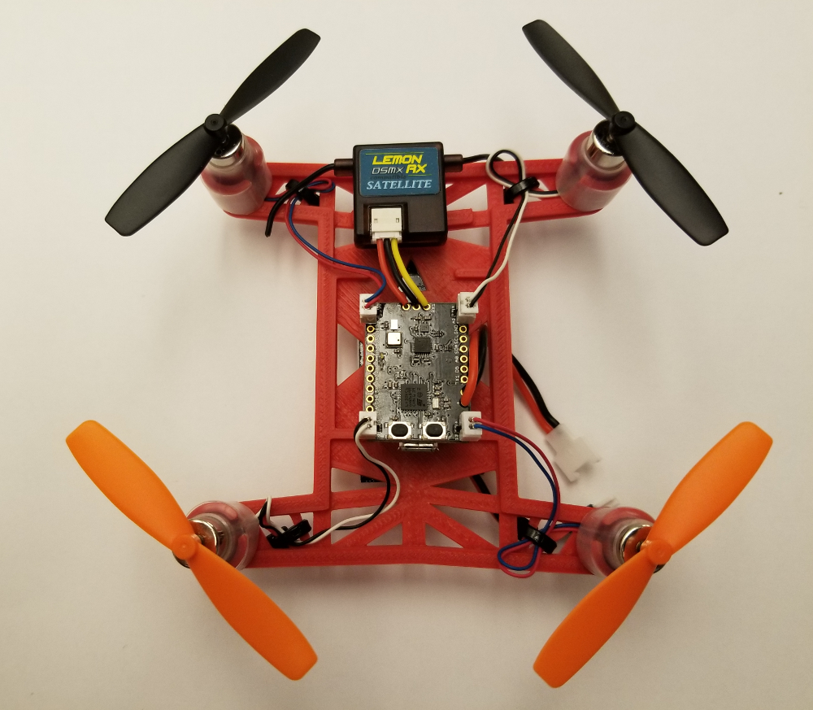

 

Welcome to the Hackflight wiki. This wiki will show you how to get started with the
[Ladybug Flight Controller](https://www.tindie.com/products/TleraCorp/ladybug-flight-controller/)
from Tlera, making it easy to build and modify flight-control firmware for this board.
Click [here](https://github.com/simondlevy/Hackflight/wiki/00-Arduino-Setup) to get started.
