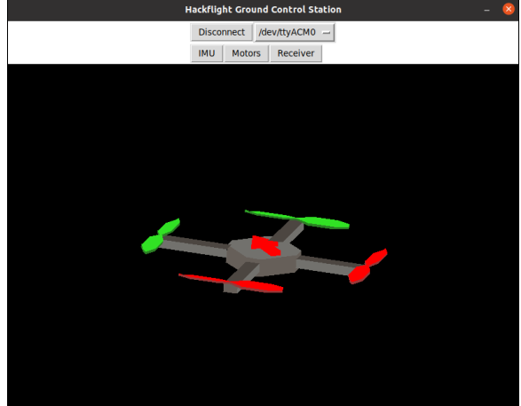

## Hackflight GCS

Hackflight GCS is a simple "Ground Control Station" that lets you visualize the
orientation of your vehicle and your RC channels and individually test the
motors (after removing propellers!). Unlike the more sophisticated 
Betaflight Configurator and Ardupilot Ground Control Station, Hackflight
GCS is not meant to help you configure your flight-control firmware, since
that is supposed to be done using C++ coding.

To build Hackflight GCS for Windows, double-click on the <b>buildgcs.bat</b>
file.  This will create a new folder <b>HackflightGCS<b> that you can drag
into your <b>Program Files</b> folder or other convenient location.

