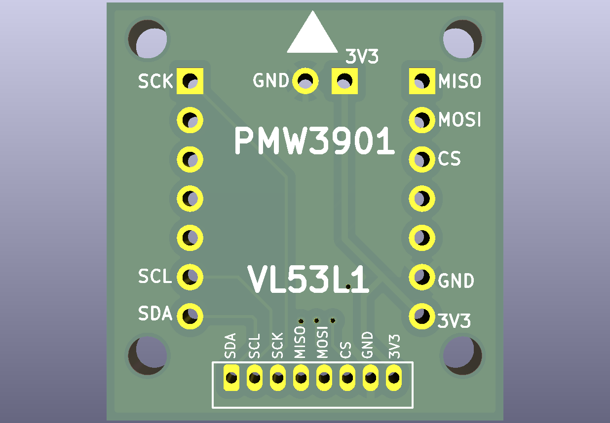

# BOM

Note: I recommend using Scotch tape to mask the pins you're not currently
soldering.

* [VL53L1 proximity sensor](https://www.tindie.com/products/onehorse/vl53l1-long-range-proximity-sensor/)

* [PMW3901 optical-flow sensor](https://www.tindie.com/products/onehorse/pmw3901-optical-flow-sensor/)

