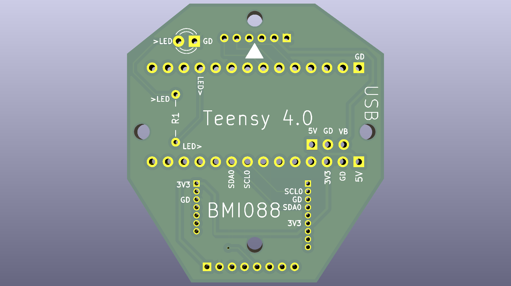

# BOM

* 4-in-1 ESC with motor/power connector

* Teensy 4.0

* Xiao ESP32 C-6

* BMI088 breakout

* [1.25mm Pitch JST Molex Picoblade connectors and Pre-Crimped Cables](https://www.amazon.com/dp/B07S18D3RN)

* [Pololu 5V Step-Up/Step-Down Voltage Regulator S7V7F5](https://www.pololu.com/product/2119)

* [1x14 short female headers](https://www.digikey.com/en/products/detail/adafruit-industries-llc/4174/10130489) on 

* [LED](https://lighthouseleds.com/1-8mm-2mm-led-red-ultra-bright.html)

* [8-pin 1.25mm Pitch JST Molex Picoblade connector, male pins, right angle](https://www.digikey.com/en/products/detail/molex/0530480810/242870)

# Soldering instuctions

Note: I recommend using Scotch tape to mask the pins you're not currently
soldering, and doing a continuity check for bridges/shorts after each step.

Main Board

1. Solder BMI088 breakout to front of board.

2. Solder voltage regulator on front.

3. Solder two 1x14 short female headers on front.

4. Solder the four resistors on back.

5. Solder the LED on front

6. Solder the 4-in-1 ESC cables on the bottom.

Hover Deck: Solder right-angle male PicoBlade connector to board

