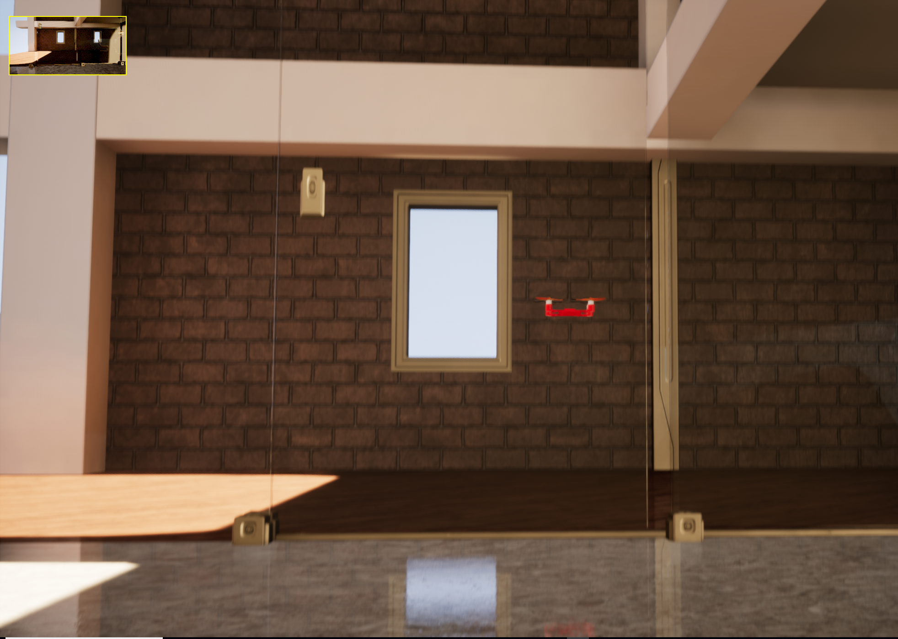
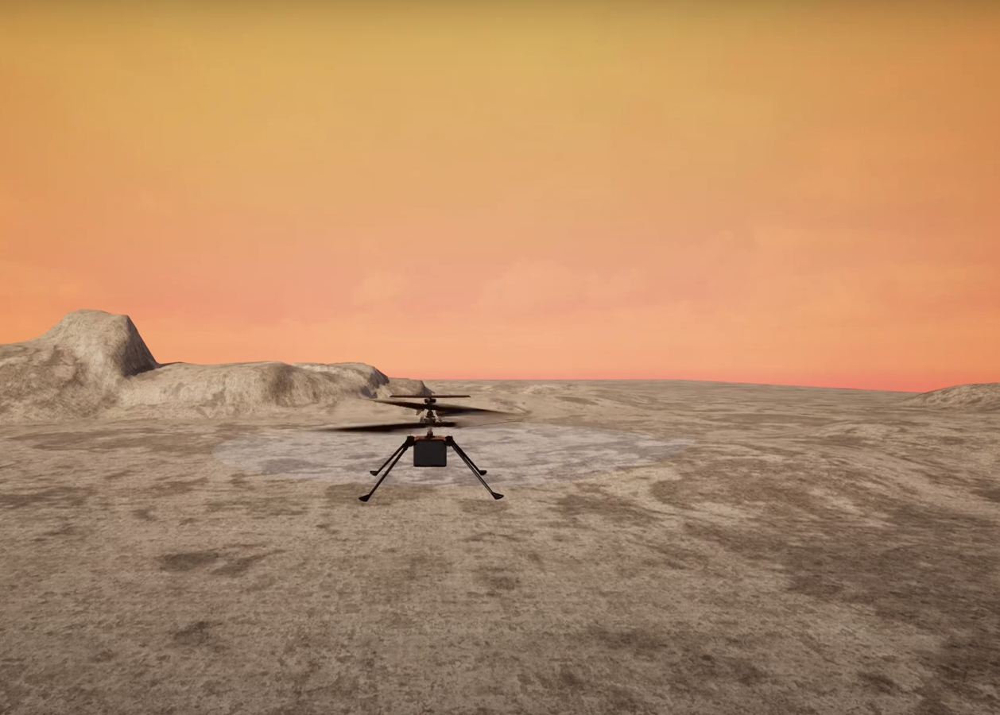

# HackflightSim

<a href="https://www.youtube.com/watch?v=mobemDcX9ew"></a>
<a href="https://www.youtube.com/watch?v=h6107MBgQ98"></a>

## About

HackflightSim is a simple multicopter flight simulator using Unreal Engine 4.  It runs on Windows.

I began this project using the [V-REP platform](https://github.com/simondlevy/Hackflight-VREP) but switched to
UnrealEngine after seeing the kinds of beautiful, real-time simulations that
Microsoft was able to get with its
[AirSim](https://github.com/Microsoft/AirSim) program. 

HackflightSim differs from AirSim in a few important ways:
* HackflightSim can be used with the same simple flight-control 
[firmware](https://github.com/simondlevy/Hackflight/tree/master/src) that we fly on our real-world 
[quadcopters](http://diydrones.com/profiles/blogs/flight-of-the-ladybug).
* HackflightSim is tiny, under 2,000 lines of code.
* HackflightSim focuses exclusively on multirotor firmware, whereas AirSim
  supports deep learning and different kinds of vehicles.

# Prerequisites

## Hardware

I am currently developing HackflightSim on an HP Z440 workstation with 32GB
RAM and NVIDIA GeForce GTX 1080 Ti. It may however be possible to develop on a
less &ldquo;loaded&rdquo; machine &ndash; see
[here](https://docs.unrealengine.com/latest/INT/GettingStarted/RecommendedSpecifications/)
for the minimum requirements recommended by Unreal Engine.

## Toolchain

1. Unreal Engine 5 (UE5). I am attempting to use the latest version, which as of the time of this
writing is UE5.0.1 To install UE5, follow these [instructions](https://docs.unrealengine.com/en-US/GettingStarted/Installation/index.html).

2. [Windows Subsystem for Linux (WSL)](https://docs.microsoft.com/en-us/windows/wsl/about)

3. [Haskell](https://www.haskell.org/)

4. [Haskell Copilot DSL](https://copilot-language.github.io/)

# Quickstart

1. Clone this repostitory (Hackflight) into your
<b>Documents/Unreal Projects</b> folder, first creating that folder if it
doesn't exist.

2. Open up a Linux terminaln (via WSL) and do:<br>
   ```cd ~/Documents/Unreal Projects/Hackflight/sim/examples/phantom```<br>
   ```make```<br>
   ```./Phantom```<br>
   ```make```<br>
      
3. Back in <b>Hackflight/sim</b>, right-click on the <b>HackflightSim.uproject</b> 
file and select <b>Generate Visual Studio project file</b> to generate a <b>.sln</b> file

4. Double-click on the resulting <b>HackflightSim.sln</b> file to launch VisualStudio.  The first time
you do this, you may have to wait a few minutes while Visual Studio parses up all of the UE4 files needed
to build the project.

5. In VisualStudio, hit the F5 key to build the project and launch UnrealEditor.

6. In UnrealEditor, select one of the maps in <b>Content/HackflightSim/Maps</b>. Then open the
<b>Content/C++ Classes/QuickstartModule/pawns</b> folder and drag one of the
vehicle pawns into the map. Click the play button and you'll see the vehicle
take off to an altitude of 10 meters.  You can use the spacebar to switch your
point-of-view.


