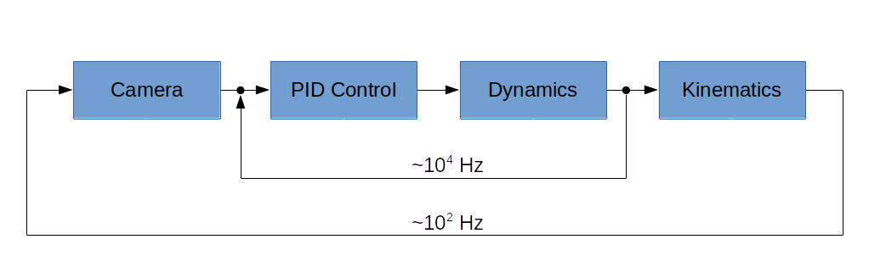

# About

MulticopterSim is a simple multicopter flight simulator using Unreal Engine 4.  It runs on Windows.

I began this project using the [V-REP platform](https://github.com/simondlevy/Hackflight-VREP) but switched to
UnrealEngine after seeing the kinds of beautiful, real-time simulations that
Microsoft was able to get with its
[AirSim](https://github.com/Microsoft/AirSim) program. 

MulticopterSim differs from AirSim in a few important ways:
* MulticopterSim can be used with the same simple flight-control 
[firmware](https://github.com/simondlevy/Hackflight/tree/master/src) that we fly on our real-world 
[quadcopters](http://diydrones.com/profiles/blogs/flight-of-the-ladybug).
* MulticopterSim is tiny, under 2,000 lines of code.
* MulticopterSim focuses exclusively on multirotor firmware, whereas AirSim
  supports deep learning and different kinds of vehicles.

# Prerequisites

## Hardware

I am currently developing MulticopterSim on an HP Z440 workstation with 32GB
RAM and NVIDIA GeForce GTX 1080 Ti. It may however be possible to develop on a
less &ldquo;loaded&rdquo; machine &ndash; see
[here](https://docs.unrealengine.com/latest/INT/GettingStarted/RecommendedSpecifications/)
for the minimum requirements recommended by Unreal Engine.

## Toolchain

You will need Unreal Engine 4 (UE4). I am attempting to use the latest version, which as of the time of this
writing is UE4.26.1. To install UE4, follow these [instructions](https://docs.unrealengine.com/en-US/GettingStarted/Installation/index.html).

# Quickstart

1. Clone this repostitory (MulticopterSim) into your
<b>Documents/Unreal Projects</b> folder, first creating that folder if it
doesn't exist.

2. Double-click <b>use_quickstart.bat</b>
   
3. Right-click on the <b>MulticopterSim.uproject</b> 
file and select <b>Generate Visual Studio project file</b> to generate a <b>.sln</b> file

4. Double-click on the resulting <b>MulticopterSim.sln</b> file to launch VisualStudio.  The first time
you do this, you may have to wait a few minutes while Visual Studio parses up all of the UE4 files needed
to build the project.

5. In VisualStudio, hit the F5 key to build the project and launch UnrealEditor.

6. In UnrealEditor, select one of the maps in <b>Content/MulticopterSim/Maps</b>. Then open the
<b>Content/C++ Classes/QuickstartModule/pawns</b> folder and drag one of the
vehicle pawns into the map. Click the play button and you'll see the vehicle
take off to an altitude of 10 meters.  You can use the spacebar to switch your
point-of-view.

# C++ development with Hackflight

Although MulticopterSim is designed to work with any flight-control software
you like, it easiest to get started with the
[Hackflight](https://github.com/simondlevy/Hackflight) software. 

For a realistic flying experience, you will also likely want some sort of game
controller or R/C transmitter.  MulticopterSim currently supports the following controllers
through the [Joystick](https://github.com/simondlevy/MulticopterSim/blob/master/Source/MainModule/joystick/Joystick.h) class:

* PS4 controller
* XBox One controller
* XBox 360 controller
* XBox 360 controller clone
* PS3 controller clone
* Logitech Extreme Pro 3D joystick
* Logitech F310 gamepad
* FrSky Taranis TX9 RC transmitter with mini USB cable 
* Spektrum transmitter with WS1000 wireless simulator dongle
* Great Planes RealFlight Interlink

If you don't have a controller, MulticopterSim will use input from the numeric keypad on your keyboard (make sure
that NumLock is turned on!)
The key mappings are based on those used in [Microsoft Flight Simulator](https://www.flightsimbooks.com/flightsimhandbook/keyboardcontrols.php#:~:text=Microsoft%20Flight%20Simulator%20Handbook%20%20%20Control%20,%20Keypad%202%20%2043%20more%20rows%20i).

To get MulticopterSim working with Hackflight, you should do the following:

1. Clone the [Hackflight](https://github.com/simondlevy/Hackflight) 
and [RoboFirmwareToolkit](https://github.com/simondlevy/RoboFirmwareToolkit) 
(RFT) repositories into your 
<b>DocumentsArduino/libraries</b> folder, first creating that folder if it
doesn't already exist.  (You don't need to install Arduino; this is simply
where MulticopterSim looks for the Hackflight firmware.)

2. Double-click <b>use_hackflight.bat</b>

3. Right-click on the <b>MulticopterSim.uproject</b> 
file and select <b>Generate Visual Studio project file</b> to generate a <b>.sln</b> file

4. Double-click on the resulting <b>MulticopterSim.sln</b> file to launch VisualStudio.
to build the project.

5. In Visual Studio, edit the file
   [MulticopterSim/Source/HackflightModule/HackflightModule.Build.cs](https://github.com/simondlevy/MulticopterSim/blob/master/Source//HackflightModule/HackflightModule.Build.cs#L16-L17)
   to reflect where you installed Hackflight / RFT.

6. In VisualStudio, hit the F5 key to build the project and launch UnrealEditor.

7. In UnrealEditor, select one of the maps in <b>Content/MulticopterSim/Maps</b>. Then open the
<b>Content/C++ Classes/HackflightModule/pawns</b> folder and drag one of the
vehicle pawns into the map. Click the play button and you're ready to take off!

## OpenCV

After you build the Hackflight module, the <b>Content/C++ Classes/Hackflight/pawns</b> folder will contain a
pawn that will run OpenCV edge detection.  By sub-classing the
[OpenCVCamera](https://github.com/simondlevy/MulticopterSim/blob/master/Source/HackflightModule/OpenCVCamera.hpp)
class you can run different kinds of machine-vision algorithms.

# Support for other programming languages / packages

MulticopterSim supports other programming languages via the SocketModule.  
An Python example is provided. To use this module, do the following:

1. Double-click <b>use_socket.bat</b>

2. Right-click on the <b>MulticopterSim.uproject</b> 
file and select <b>Generate Visual Studio project file</b> to generate a <b>.sln</b> file

3. Double-click on the resulting <b>MulticopterSim.sln</b> file to launch VisualStudio.
to build the project.

4. In VisualStudio, hit the F5 key to build the project and launch UnrealEditor.

5. In UnrealEditor, select one of the maps in <b>Content/MulticopterSim/Maps</b>. Then open the
<b>Content/C++ Classes/SocketModule/pawns</b> folder and drag one of the
vehicle pawns into the map.  

Then follow the directions in
[this folder](https://github.com/simondlevy/MulticopterSim/tree/master/Extras/python).

# Design principles

The core of MulticopterSim is the abstract C++ 
[FlightManager](https://github.com/simondlevy/MulticopterSim/blob/master/Source/MainModule/FlightManager.hpp) 
class. This class provides support for running the vehicle dynamics and the PID control
regime (e.g., Hackflight) on its own thread, after it first disables the
built-in physics in UE4.  The dynamics we used are based directly on the model
presented in this [paper](https://infoscience.epfl.ch/record/97532/files/325.pdf), 
written as a standalone, header-only C++ 
[class](https://github.com/simondlevy/MulticopterSim/blob/master/Source/MainModule/Dynamics.hpp)
that can be easily adapted for other simulators and applications if desired.
This class also supports different frame configurations (quadcopter,
hexacopter) via virtual methods. By running the FlightManager on its own
thread, we are able to achieve arbitrarily fast updates of the dynamics and
flight-control.  It would also be possible to run the dynamics and control on
separate threads, though we have not yet found it advantageous to do that.

The FlightManager API contains a single virtual 
[getMotors](https://github.com/simondlevy/MulticopterSim/blob/master/Source/MainModule/FlightManager.hpp#L26-L35)
method that accepts the current time and the state of the vehicle (as computed by the
dynamics), and returns the current motor values.  The motor values are then
passed to the dynamics object, which computes the new vehicle state.  On the
main thread, UE4's <b>Tick()</b> method queries the flight manager for the
current vehicle pose (location, rotation) and displays the vehicle and its
environment kinematically at the 60-120Hz frame rate of the game engine.  In a
similar manner, the 
[Camera](https://github.com/simondlevy/MulticopterSim/blob/master/Source/MainModule/Camera.hpp)
class can be used to process
the images collected by a simulated gimbal-mounted camera on the vehicle, using
a library like OpenCV (see [above](#opencv)).  Computer-vision algorithms running in a Camera subclass can then be used
as input to the PID control running in the FlightManager.  The following figure
illustrates this arrangement, using a traditional
[cascade-control](https://controlguru.com/the-cascade-control-architecture/)
(slow outer loop / fast inner loop) diagram:

</a>

In addition, an abstract, threaded C++
[TargetManager](https://github.com/simondlevy/MulticopterSim/blob/master/Source/MainModule/TargetManager.hpp)
class supports modeling interaction with other moving objects having their own dynamics; for example,
in a predator/prey scenario. 

