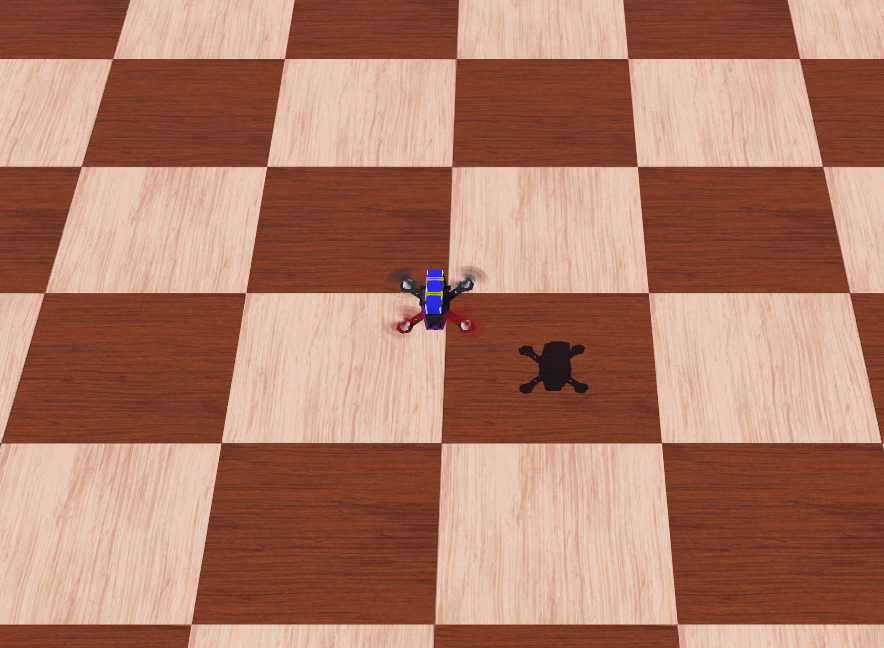
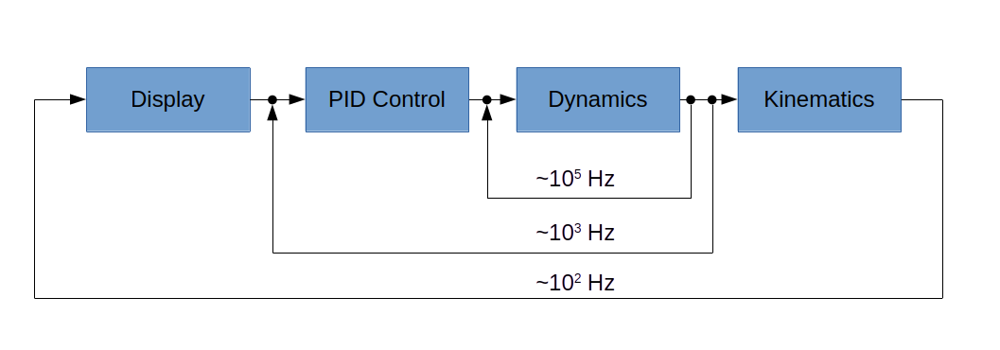

<p align="center"> 

</p>

## Hackflight simulator instructions

1. [Install Webots](https://cyberbotics.com/doc/guide/installation-procedure#installation-on-linux)
on your computer.  

2. Add the following line to your ```~/.bashrc``` file:

```
  export WEBOTS_HOME=/usr/local/webots
```

3. From the hackflight main directory, do the following:

```
cd webots/plugins/physics/standard
make
cd ../../../controllers/controller
make
make runstandard
```

If you have a game controller or R/C transmitter with adapter dongle, you can
use that to fly (right shoulder button to takeoff and land);  otherwise, the
simulator will advise you that no such device was found and instruct you on how
to fly with the keyboard.  The following devices are currently supported:

* [MGEAR Wired Controller for PS3](https://www.officedepot.com/a/products/7123231/Gear-Wired-Controller-For-PS3-Black/)
* [Logitech Gamepad F310](https://www.amazon.com/gp/product/B003VAHYQY)
* [Xbox Series S|X Controller](https://a.co/d/7QbSZaZ)

## Design principles

The [basic time step](https://cyberbotics.com/doc/reference/worldinfo) in
Webots is 32 milliseonds, which translates to an update rate of around 31 Hz
in the control code (e.g., PID control).  Although adequate for many robot
applications, this rate is much slower than the typical rate of 500 - 1000 Hz
used in actual flight controllers.  Although it is possible to decrease the
timestep in order to increase the update rate, there is as usual a
[tradeoff](https://robotics.stackexchange.com/questions/24086/how-can-i-speed-up-my-webots-simulation),
in which a faster update rate can slow down the simulation.  Fortunately, Webots supports 
[custom physics plugins](https://cyberbotics.com/doc/reference/physics-plugin),
in which you can replace Webots' built-in physics with a physics model
of your own.   The Hackflight simulator exploits this feature of Webots,
using a
[dynamics model](https://github.com/simondlevy/Hackflight/blob/master/src/dynamics.hpp)
based on the equestions
presented in this [paper](https://infoscience.epfl.ch/record/97532/files/325.pdf).
The webots update step represents a slow, outer loop, in which is embeded
a faster control loop, which in turn embeds an even faster dynamics loop.
The following figure illustrates this arrangement, using a traditional
[cascade-control](https://controlguru.com/the-cascade-control-architecture/)
diagram:



